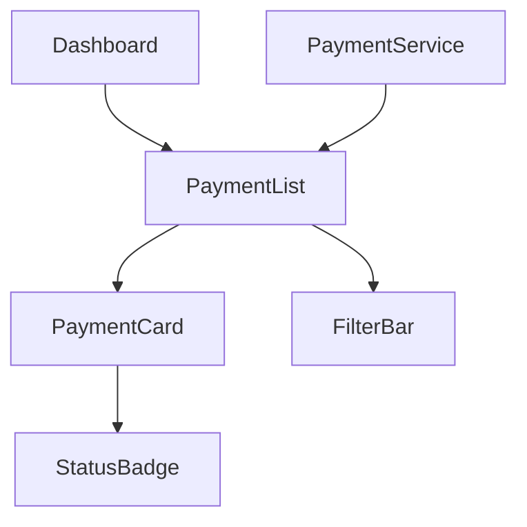

# CLAUDE.md

This file provides guidance to Claude Code (claude.ai/code) when working with code in this repository.

## Project Overview

A financial tracker application built with Next.js 15.5.4, React 19, and TypeScript. The app helps users track and manage payments by showing what's pending, due, and past due.

## Development Commands

```bash
# Start development server with Turbopack
npm run dev

# Build for production with Turbopack
npm run build

# Start production server
npm start

# Lint code with Biome
npm run lint

# Format code with Biome
npm run format
```

## Technology Stack

- **Framework**: Next.js 15.5.4 (App Router)
- **Language**: TypeScript with strict mode enabled
- **Styling**: Tailwind CSS v4 with PostCSS plugin
- **UI Components**: shadcn/ui (New York style)
- **Theming**: next-themes for dark/light mode support
- **Fonts**: Geist Sans and Geist Mono (loaded via next/font)
- **Linter/Formatter**: Biome 2.2.0
- **Build Tool**: Turbopack (Next.js default)

## Code Quality Tools

### Biome Configuration

The project uses Biome for both linting and formatting with:
- 2-space indentation
- Recommended rules enabled for Next.js and React
- Import organization on save
- Git integration with VCS-aware linting
- `noUnknownAtRules` disabled for Tailwind CSS compatibility

## Architecture

### File Structure

```
src/
├── app/
│   ├── layout.tsx           # Root layout with ThemeProvider
│   ├── page.tsx             # Home page
│   └── globals.css          # Global styles, Tailwind, and shadcn variables
├── components/
│   ├── ui/                  # shadcn/ui components
│   │   └── button.tsx       # Button component
│   ├── theme-provider.tsx   # next-themes wrapper
│   └── theme-switcher.tsx   # Theme toggle component
└── lib/
    └── utils.ts             # Utility functions (cn helper)
```

### Path Aliases

- `@/*` maps to `./src/*` (configured in tsconfig.json)

### Styling Approach

- Uses Tailwind CSS v4 with the `@theme inline` directive
- shadcn/ui components with HSL color system
- CSS variables for theming defined in `globals.css`:
  - Light and dark mode variables (background, foreground, primary, secondary, etc.)
  - Component-specific colors (card, popover, muted, accent, destructive)
  - Border, input, and ring colors
  - Custom fonts mapped to Geist Sans and Geist Mono
- Dark mode controlled by next-themes with class-based switching
- Theme persisted to localStorage with system preference support
- Tailwind imports handled via PostCSS with `@tailwindcss/postcss` plugin

### UI Component System

#### shadcn/ui Configuration
- Style: New York
- Base color: Neutral
- CSS variables enabled
- RSC (React Server Components) compatible
- Configuration file: `components.json`

#### Adding New shadcn Components
To add new shadcn/ui components, manually create them in `src/components/ui/` following the shadcn/ui documentation, as the CLI may not be fully compatible with this setup.

#### Component Guidelines
- All UI components live in `src/components/ui/`
- Use the `cn()` utility from `@/lib/utils` for conditional class names
- Components follow shadcn/ui patterns with class-variance-authority for variants
- Built on Radix UI primitives for accessibility

### TypeScript Configuration

- Target: ES2017
- Strict mode enabled
- Module resolution: bundler
- Incremental compilation enabled
- Next.js TypeScript plugin included

## Development Notes

- The development and build processes use Turbopack for faster compilation
- Hot module reloading is enabled by default in dev mode
- The app uses the Next.js App Router (not Pages Router)
- Theme switching is client-side only - use `"use client"` directive when using theme hooks
- The `suppressHydrationWarning` prop on `<html>` prevents hydration warnings from next-themes

## Code Quality Requirements

**Every feature must:**
1. Pass Biome linting (`npm run lint`)
2. Be formatted with Biome (`npm run format`)
3. Pass all unit tests (once test suite is implemented)

## Feature Development Methodology

This project follows a Behavior-Driven Development (BDD) approach. For each new feature, three documents must be created before implementation begins:

### 1. Specification Document (Spec)

**Purpose:** Defines what the feature should do from a user perspective.

**Structure:**
- **Introduction**: Overview of the feature and its purpose
- **Requirements**: Numbered requirements, each containing:
  - **User Story**: "As a [role], I want [goal], so that [benefit]"
  - **Acceptance Criteria**: BDD clauses using WHEN/THEN/IF format
    - WHEN [condition] THEN the system SHALL [expected behavior]
    - IF [condition] THEN the system SHALL [expected behavior]

**Example:**
```markdown
### Requirement 1: View Payment Status

**User Story:** As a user, I want to see all my payments categorized by status, so that I can track what's pending, due, and overdue.

#### Acceptance Criteria

1. WHEN a user views the dashboard THEN the system SHALL display payments grouped by status (pending, due, overdue)
2. WHEN a payment is overdue THEN the system SHALL highlight it in red with a warning indicator
3. IF there are no payments THEN the system SHALL display an empty state with a call-to-action
```

**Location:** `specs/[feature-name]/spec.md`

### 2. Architecture Document (Design)

**Purpose:** Defines how the feature will be implemented technically.

**Structure:**
- **Overview**: High-level description of the implementation approach
- **Architecture**: Component diagram using Mermaid
- **Components and Interfaces**: Detailed breakdown of:
  - TypeScript interfaces and types
  - React components and their props
  - Functions and utilities
  - Database tables and schemas
  - API endpoints
  - State management structure
- **Data Models**: Complete type definitions
- **Error Handling**: Error scenarios and recovery strategies
- **Testing Strategy**: Unit, integration, and E2E testing approach
- **Security Considerations**: Authentication, authorization, data protection
- **Performance Considerations**: Optimization strategies

**Example Mermaid Diagram:**


**Must Reference:** Should reference specific requirements from the spec document (e.g., "_Requirements: 1.1, 1.2, 1.3_")

**Location:** `specs/[feature-name]/design.md`

### 3. Tasks Document (Implementation Plan)

**Purpose:** Breaks down the implementation into actionable tasks.

**Structure:**
- Hierarchical task list with checkboxes
- Tasks grouped by implementation phase
- Each task references related requirements
- Optional tasks marked with `- [ ]*` (typically accessibility, unit tests, integration tests)

**Task Format:**
```markdown
- [ ] 1. Set up component structure
  - Create directory structure for feature components
  - Define TypeScript interfaces
  - _Requirements: 1.1, 1.2_

- [ ] 2. Implement core functionality
- [ ] 2.1 Build PaymentList component
  - Implement filtering and sorting logic
  - _Requirements: 1.1, 1.3_

- [ ]* 2.2 Write unit tests for PaymentList
  - Test filtering and edge cases
  - _Requirements: 1.1_
```

**Task Organization Guidelines:**
- Main tasks (numbered: 1, 2, 3...)
- Sub-tasks (numbered: 2.1, 2.2, 2.3...)
- Optional tasks marked with `*` after the checkbox
- Requirements referenced at the end of each task description

**Location:** `specs/[feature-name]/tasks.md`

### BDD Workflow

When a new feature is requested:

1. **Specification Phase**: Create the spec document with requirements and acceptance criteria
2. **Design Phase**: Create the architecture document with technical implementation details
3. **Planning Phase**: Create the tasks document with implementation breakdown
4. **Review Phase**: Review all three documents before coding begins
5. **Implementation Phase**: Follow the tasks document, marking tasks as completed
6. **Validation Phase**: Verify all acceptance criteria from the spec are met

### Document Storage

All feature documentation should be stored in:
```
specs/
└── [feature-name]/
    ├── spec.md
    ├── design.md
    └── tasks.md
```

### Important Notes

- Documents are created **only when explicitly requested** for a new feature
- All three documents should be created before implementation begins
- Documents must reference each other (design references spec, tasks reference requirements)
- Optional tasks (`- [ ]*`) should cover: accessibility, unit tests, integration tests, performance optimizations
- All documents use Markdown format
- Mermaid diagrams should be used in architecture documents for visual clarity
