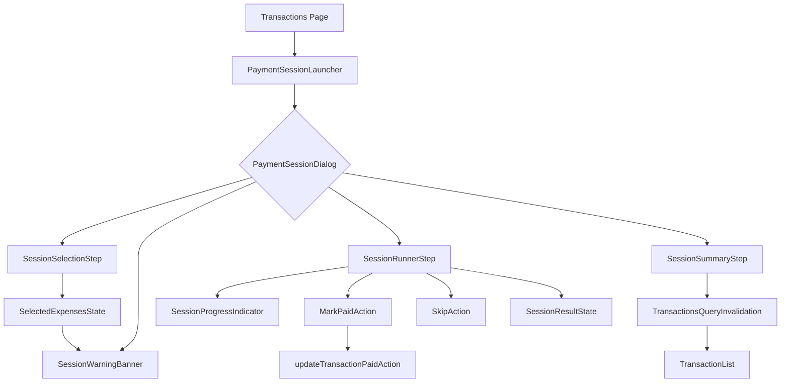

# Payment Session Feature Design

## Overview

The payment session feature adds a guided workflow that helps users process multiple unpaid expenses sequentially. The flow starts from the transactions screen, lets users select eligible expenses, surfaces coverage warnings when selections exceed billing period income, and provides a focused runner interface with clear actions to mark each transaction as paid or skip it. Upon completion, a summary confirms the outcomes and synchronizes the underlying transactions list. _Requirements: 1.1-1.3, 2.1-2.5, 3.1-3.3, 4.1-4.5, 5.1-5.4_

## Architecture



## Components and Interfaces

- `PaymentSessionLauncher` (client component)
  - Props: `transactions: Transaction[]`
  - Renders the "Start Payment Session" button and manages dialog visibility. _Requirements: 1.1-1.3_
  - Depends on React Query cache for current transactions.
- `PaymentSessionDialog`
  - Controls the multi-step workflow (`selection`, `runner`, `summary`), handles close/reset behavior, and shares context via React hooks or Zustand store. _Requirements: 2.*, 4.*, 5.*_
- `SessionSelectionStep`
  - Lists unpaid expenses grouped by billing period starting with the period selected on the transactions page (annotated as current) and descending through past periods, providing checkbox toggles, running totals, and "Next" button gating. _Requirements: 2.1-2.5_
  - Utilizes derived helpers:
    - `groupExpensesByPeriod(transactions, selectedPeriod): SessionPeriodGroup[]`
    - `calculateIncomeTotals(transactions, billingPeriod): { incomeTotal: number; expenseTotal: number }`
- `SessionWarningBanner`
  - Shows the coverage warning when selected total > current billing period income and clarifies the comparison basis. _Requirements: 3.1-3.3_
- `SessionRunnerStep`
  - Presents focused view for current transaction with `Mark as paid` and `Skip` buttons, plus progress cues. _Requirements: 4.1-4.5_
  - Uses optimistic updates via React Query when marking paid.
- `SessionSummaryStep`
  - Displays lists and totals for paid vs skipped items, then triggers cache invalidation and closes dialog. _Requirements: 5.1-5.3_
- Shared Types
  - `type SessionTransaction = Transaction & { order: number }`
  - `interface PaymentSessionState { phase: "selection" | "runner" | "summary"; selectedIds: string[]; orderedQueue: SessionTransaction[]; index: number; results: { paid: SessionTransaction[]; skipped: SessionTransaction[] }; warningAcknowledged: boolean; }`
  - Consider colocating state inside dialog via `useReducer` for isolated workflow control.

## Functions and Utilities

- `getBillingPeriodIncome(transactions, billingPeriod)` → sums `type === "income"` within current period for coverage warning. _Requirements: 3.1_
- `groupExpensesByPeriod(transactions, selectedPeriod)` → returns ordered data structure with labeled current/past periods for selection UI based on the selected billing period. _Requirements: 2.1-2.2_
- `partitionSessionResults(queue, results)` → prepares summary data. _Requirements: 5.1_
- `advanceSession(resultType)` → helper to update state index and move to summary upon completion. _Requirements: 4.*

## API & Server Actions

- Reuse `updateTransactionPaidAction(id, paid)` for marking transactions as paid. _Requirements: 4.2, 5.2_
- Potential helper `updateTransactionsPaidAction(ids: string[])` to mark multiple items at summary (optional). Evaluate reusing single-action sequential calls with optimistic updates vs batching.
- Ensure `revalidatePath("/app/transactions")` is triggered after paid updates or rely on React Query invalidation client-side. _Requirements: 5.3_

## State Management

- Local dialog reducer:
  - `phase`, `selectedIds`, `queue`, `index`, `results.paid`, `results.skipped`, `warningAcknowledged`.
  - Actions: `OPEN_LAUNCHER`, `SET_SELECTION`, `ACK_WARNING`, `START_SESSION`, `MARK_PAID`, `SKIP`, `FINISH`, `RESET`.
- React Query:
  - Provide `transactions` via existing query key.
  - Use `queryClient.invalidateQueries(QUERY_KEYS.transactions)` after summary close. _Requirements: 5.3_

## Data Models

- Transactions schema already includes: `id`, `name`, `type`, `value`, `currency`, `dueDate`, `priority`, `paid`, `userId`.
- Derived session data extends with ordering/index:
  ```ts
  interface SessionResult {
    paid: SessionTransaction[];
    skipped: SessionTransaction[];
  }

  interface SessionPeriodGroup {
    label: string; // e.g., "October 2025 (current)"
    period: BillingPeriod;
    transactions: SessionTransaction[];
  }
  ```
- Warning calculations rely on aggregate sums over selected expenses and incomes within `BillingPeriod`.

## Error Handling

- If marking as paid fails:
  - Show toast via `sonner` and revert optimistic update. _Requirements: 5.4_
- If fetching transactions fails inside dialog, fall back to empty state message mirroring list component.
- Session state resets to selection on dialog close or failure to maintain consistency.

## Testing Strategy

- Unit tests:
  - Reducer logic for `PaymentSessionState` transitions. _Requirements: 4.*, 5.*
  - Utility functions for totals and warning logic. _Requirements: 3.*
- Component tests (React Testing Library):
  - `SessionSelectionStep` behavior for toggling and gating the "Next" button. _Requirements: 2.*
  - `SessionRunnerStep` verifying mark/skip flows and progress indicator. _Requirements: 4.*
- Integration tests (optional):
  - Simulate end-to-end session flow ensuring summary sync updates transactions query. _Requirements: 5.*

## Security Considerations

- Ensure paid updates continue verifying authenticated user via server actions (existing pattern). _Requirements: 5.2_
- Prevent user from marking transactions they do not own; rely on server-side checks.
- No additional sensitive data is displayed; continue respecting locale and currency formatting.

## Performance Considerations

- Group expenses by billing period and collapse past-period sections by default if volume becomes high (optional enhancement).
- Defer network updates until user confirms actions to reduce round-trips (optional). If applying optimistic updates per transaction, ensure minimal revalidation overhead by batching invalidations on summary close.
- Dialog and runner components should lazy-mount to avoid impacting initial transactions page render.
