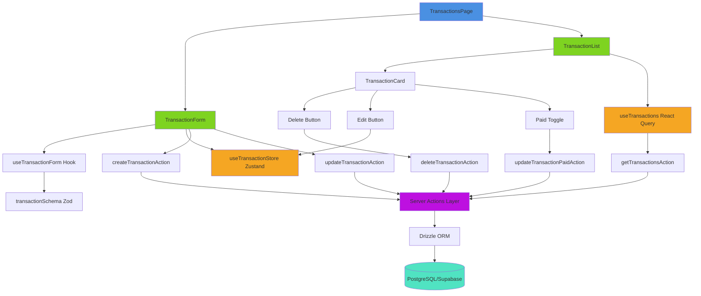

# Transaction Management Feature - Architecture Design

_Requirements: 1, 2, 3, 4, 5, 6, 7, 8, 9_

## Overview

The Transaction Management feature is implemented using Next.js App Router with a client-side form and list, server actions for data mutations, React Query for data fetching and cache management, and Zustand for client-side state management. The architecture follows a clear separation between presentation, business logic, and data access layers.

**Key Technologies:**
- **UI**: React 19, shadcn/ui components, Tailwind CSS v4
- **Forms**: react-hook-form with Zod validation
- **State Management**: Zustand for UI state (edit mode, selected transaction)
- **Data Fetching**: React Query (@tanstack/react-query) for server state
- **Data Mutations**: Next.js Server Actions
- **Database**: Drizzle ORM with PostgreSQL (Supabase)
- **Theme**: next-themes for dark/light mode support

## Architecture



## Components and Interfaces

### 1. Page Component

**File:** `src/app/app/transactions/page.tsx`

```typescript
export default function TransactionsPage() {
  // Main page component
  // Renders TransactionForm and TransactionList in responsive layout
  // Protected by auth middleware
}
```

### 2. Transaction Form Component

**File:** `src/components/transactions/transaction-form.tsx`

```typescript
interface TransactionFormProps {
  className?: string;
}

export function TransactionForm({ className }: TransactionFormProps) {
  // Uses react-hook-form with zodResolver
  // Integrates with Zustand store for edit mode
  // Calls server actions for create/update
  // Handles form submission, validation errors, and success states
}
```

### 3. Transaction List Component

**File:** `src/components/transactions/transaction-list.tsx`

```typescript
interface TransactionListProps {
  className?: string;
}

export function TransactionList({ className }: TransactionListProps) {
  // Uses React Query to fetch transactions
  // Renders TransactionCard components
  // Handles loading and empty states
  // Automatically sorts transactions per spec
}
```

### 4. Transaction Card Component

**File:** `src/components/transactions/transaction-card.tsx`

```typescript
interface TransactionCardProps {
  transaction: Transaction;
}

export function TransactionCard({ transaction }: TransactionCardProps) {
  // Displays transaction details
  // Provides edit, delete, and paid toggle actions
  // Uses shadcn Card, Badge, Button, Checkbox components
  // Renders priority badge, type indicator, and paid status
}
```

### 5. Custom Hooks

**File:** `src/hooks/use-transaction-form.ts`

```typescript
export function useTransactionForm() {
  // Encapsulates react-hook-form logic
  // Integrates with Zustand store
  // Handles create/update/cancel actions
  // Returns form state and handlers
}
```

### 6. Zustand Store

**File:** `src/stores/transaction-store.ts`

```typescript
interface TransactionStore {
  editingTransaction: Transaction | null;
  isEditMode: boolean;
  setEditingTransaction: (transaction: Transaction | null) => void;
  clearEditMode: () => void;
}

export const useTransactionStore = create<TransactionStore>((set) => ({
  editingTransaction: null,
  isEditMode: false,
  setEditingTransaction: (transaction) => set({
    editingTransaction: transaction,
    isEditMode: !!transaction,
  }),
  clearEditMode: () => set({
    editingTransaction: null,
    isEditMode: false,
  }),
}));
```

### 7. Server Actions

**File:** `src/actions/transaction-actions.ts`

```typescript
export async function getTransactionsAction(): Promise<Transaction[]> {
  // Fetches all transactions for current user
  // Applies sorting: unpaid first, then by priority, then by createdAt
  // Returns sorted array
}

export async function createTransactionAction(
  data: NewTransaction
): Promise<{ success: boolean; error?: string; transaction?: Transaction }> {
  // Validates user authentication
  // Creates new transaction in database with user_id
  // Returns result with error handling
}

export async function updateTransactionAction(
  id: string,
  data: Partial<NewTransaction>
): Promise<{ success: boolean; error?: string; transaction?: Transaction }> {
  // Validates user authentication and ownership
  // Updates transaction in database
  // Returns result with error handling
}

export async function deleteTransactionAction(
  id: string
): Promise<{ success: boolean; error?: string }> {
  // Validates user authentication and ownership
  // Deletes transaction from database
  // Returns result with error handling
}

export async function updateTransactionPaidAction(
  id: string,
  paid: boolean
): Promise<{ success: boolean; error?: string; transaction?: Transaction }> {
  // Validates user authentication and ownership
  // Updates paid status only
  // Returns result with error handling
}
```

## Data Models

### Transaction Schema (Zod)

**File:** `src/lib/validations/transaction-schema.ts`

```typescript
import { z } from "zod";

export const transactionTypeEnum = z.enum(["income", "expense"]);
export const priorityEnum = z.enum([
  "very_high",
  "high",
  "medium",
  "low",
  "very_low",
]);

export const transactionSchema = z.object({
  type: transactionTypeEnum,
  name: z.string().min(1, "Name is required"),
  value: z.coerce
    .number({ invalid_type_error: "Value must be a number" })
    .positive("Value must be a positive number")
    .multipleOf(0.01, "Value can have at most 2 decimal places"),
  currency: z.string().default("USD"),
  dueDate: z.date({ required_error: "Due date is required" }),
  priority: priorityEnum,
  paid: z.boolean().default(false),
});

export type TransactionFormData = z.infer<typeof transactionSchema>;
```

### Database Schema Extension

**File:** `src/db/schema.ts`

Add `userId` column to the existing `transactions` table:

```typescript
export const transactions = pgTable("transactions", {
  id: uuid("id").defaultRandom().primaryKey(),
  userId: text("user_id").notNull(), // References Supabase auth.users
  type: transactionTypeEnum("type").notNull(),
  name: text("name").notNull(),
  value: numeric("value", { precision: 19, scale: 2 }).notNull(),
  currency: text("currency").notNull().default("USD"),
  dueDate: timestamp("due_date", { withTimezone: true }).notNull(),
  priority: priorityEnum("priority").notNull(),
  paid: boolean("paid").notNull().default(false),
  createdAt: timestamp("created_at", { withTimezone: true })
    .notNull()
    .defaultNow(),
  updatedAt: timestamp("updated_at", { withTimezone: true })
    .notNull()
    .defaultNow(),
});

// Add index for performance
export const transactionsUserIdIdx = index("transactions_user_id_idx").on(
  transactions.userId
);

// Add composite index for optimized sorting
export const transactionsSortIdx = index("transactions_sort_idx").on(
  transactions.userId,
  transactions.paid,
  transactions.priority,
  transactions.createdAt
);
```

**Note:** Supabase auth users are managed in `auth.users` schema. We reference `user_id` as text to match Supabase's UUID string format. No explicit foreign key constraint needed as Supabase manages auth separately, but we enforce via application logic.

## React Query Configuration

**File:** `src/lib/react-query.ts`

```typescript
import { QueryClient } from "@tanstack/react-query";

export const queryClient = new QueryClient({
  defaultOptions: {
    queries: {
      staleTime: 1000 * 60 * 5, // 5 minutes
      gcTime: 1000 * 60 * 10, // 10 minutes (formerly cacheTime)
      refetchOnWindowFocus: false,
      retry: 1,
    },
  },
});

export const QUERY_KEYS = {
  transactions: ["transactions"] as const,
};
```

**Provider Setup:** `src/app/app/layout.tsx`

```typescript
"use client";

import { QueryClientProvider } from "@tanstack/react-query";
import { queryClient } from "@/lib/react-query";

export default function AppLayout({ children }) {
  return (
    <QueryClientProvider client={queryClient}>
      {children}
    </QueryClientProvider>
  );
}
```

## Transaction Sorting Logic

**File:** `src/lib/utils/sort-transactions.ts`

```typescript
import type { Transaction } from "@/db/schema";

const priorityOrder = {
  very_high: 0,
  high: 1,
  medium: 2,
  low: 3,
  very_low: 4,
} as const;

export function sortTransactions(transactions: Transaction[]): Transaction[] {
  return [...transactions].sort((a, b) => {
    // Primary: unpaid first
    if (a.paid !== b.paid) {
      return a.paid ? 1 : -1;
    }

    // Secondary: by priority
    const priorityDiff = priorityOrder[a.priority] - priorityOrder[b.priority];
    if (priorityDiff !== 0) {
      return priorityDiff;
    }

    // Tertiary: newest first
    return new Date(b.createdAt).getTime() - new Date(a.createdAt).getTime();
  });
}
```

## Error Handling

### Server Actions Error Handling

- All server actions return `{ success: boolean; error?: string; data?: T }` pattern
- Authentication errors: Return `{ success: false, error: "Unauthorized" }`
- Validation errors: Return `{ success: false, error: "Validation error message" }`
- Database errors: Catch and return generic error message (log detailed error server-side)
- Ownership validation: Check user owns transaction before update/delete

### Client-Side Error Handling

- Form validation errors: Display inline with field using react-hook-form
- Server action errors: Display toast notification using shadcn toast component
- React Query errors: Display error message in list component
- Network errors: React Query automatic retry (1 attempt)

### Toast Notifications

**File:** Add shadcn toast component

```bash
npx shadcn@latest add toast
```

Use for:
- Success: "Transaction created successfully"
- Update: "Transaction updated successfully"
- Delete: "Transaction deleted successfully"
- Errors: Display error message from server action

## Testing Strategy

### Unit Tests (Optional)

1. **Validation Schema Tests**
   - Test all validation rules (required fields, positive values, etc.)
   - Test default values (currency = "USD", paid = false)

2. **Utility Function Tests**
   - Test `sortTransactions` with various scenarios
   - Test priority ordering
   - Test date ordering within priority groups

3. **Zustand Store Tests**
   - Test setEditingTransaction
   - Test clearEditMode
   - Test state transitions

### Integration Tests (Optional)

1. **Form Component Tests**
   - Test form submission with valid data
   - Test validation error display
   - Test edit mode population
   - Test cancel button behavior

2. **List Component Tests**
   - Test transaction rendering
   - Test empty state display
   - Test loading state display
   - Test sorting behavior

3. **Server Actions Tests**
   - Test CRUD operations with mocked database
   - Test authentication validation
   - Test ownership validation
   - Test error scenarios

### E2E Tests (Optional)

1. Create transaction flow
2. Edit transaction flow
3. Delete transaction flow
4. Toggle paid status flow
5. Responsive layout verification
6. Theme switching verification

## Security Considerations

### Authentication & Authorization

- All server actions validate user authentication via Supabase `auth.getUser()`
- Transactions are scoped to user via `user_id` column
- Update and delete actions verify user owns the transaction
- Middleware protects `/app` routes (already implemented)

### Input Validation

- Client-side: Zod schema validation via react-hook-form
- Server-side: Re-validate all inputs in server actions using same Zod schema
- Prevent SQL injection: Use Drizzle ORM parameterized queries
- Sanitize HTML: No raw HTML rendering (React auto-escapes)

### Data Access

- Use Drizzle ORM for all database queries
- Always filter by `user_id` in queries
- Use server-side Supabase client for authenticated requests
- Never expose raw SQL or database structure to client

### Environment Variables

- `DATABASE_URL` must be set and validated
- Never expose database credentials to client
- Server actions run server-side only (not exposed to client)

## Performance Considerations

### Database Optimization

- Index on `user_id` column for fast filtering (`transactions_user_id_idx`)
- Composite index on `(user_id, paid, priority, createdAt)` for optimal sorting (`transactions_sort_idx`)
- Limit query results if list grows large (pagination future enhancement)

### React Query Optimization

- 5-minute stale time reduces unnecessary refetches
- Optimistic updates for paid toggle (instant UI feedback)
- Automatic cache invalidation on mutations
- Prefetch transactions on page mount

### Bundle Size

- Use dynamic imports for heavy components if needed
- shadcn components are tree-shakeable
- React Query and Zustand have small bundle sizes

### Rendering Performance

- Use React.memo for TransactionCard if list is large
- Avoid inline functions in map iterations
- Use key prop with transaction.id for list rendering
- Debounce form validation if performance issues arise

## Accessibility Implementation

### Keyboard Navigation

- All interactive elements focusable via Tab
- Logical tab order: form fields → submit button → list items
- Visible focus indicators via Tailwind focus-visible utilities
- Escape key to cancel edit mode

### Screen Reader Support

- Form labels associated with inputs via htmlFor
- Error messages linked via aria-describedby
- Button aria-labels for icon-only buttons (Edit, Delete)
- Live region announcements for CRUD operations (aria-live="polite")
- Form mode announced (Create vs Edit) via aria-live
- Transaction count announced in list header

### Semantic HTML

- Use `<form>` element for transaction form
- Use `<button>` for all interactive actions (not divs)
- Use `<label>` for form labels
- Use proper heading hierarchy (`<h1>`, `<h2>`)
- Use `<section>` for major layout areas

### Color and Contrast

- WCAG AA compliant color contrasts (4.5:1 for text)
- Don't rely on color alone for paid status (use checkmark icon + text)
- Priority badges use both color and text label
- High contrast focus indicators in both themes
- Test with browser accessibility tools

### Touch Targets

- Minimum 44x44px touch targets on mobile
- Adequate spacing between interactive elements (min 8px)
- Larger form inputs on mobile devices
- Larger buttons on touch devices

## Theme Support Implementation

### CSS Variables

- Use Tailwind CSS v4 with next-themes
- All components use theme-aware classes (bg-background, text-foreground, etc.)
- Edit mode indicator uses theme-aware colors (e.g., border-primary, bg-primary/10)
- Custom theme variables in globals.css (already set up)

### Component Implementation

- All shadcn components support themes by default
- Form uses theme-aware input components
- Transaction cards use theme-aware card component
- Priority badges use theme-aware badge variants
- Edit mode indicator visible in both themes

### Testing Themes

- Manually test all states in both light and dark mode
- Verify contrast ratios meet WCAG AA in both themes
- Ensure edit mode indicator is clearly visible in both themes
- Test with browser DevTools color contrast checker

## Responsive Implementation

### Layout Breakpoints

- Mobile: `< 768px` - vertical stack (form top, list bottom)
- Tablet: `768px - 1023px` - horizontal split (40/60)
- Desktop: `≥ 1024px` - horizontal split (30-35/65-70)

### Tailwind CSS Implementation

Use Tailwind responsive utilities:

```tsx
<div className="flex flex-col lg:flex-row gap-6">
  {/* Form: full width on mobile, 35% on desktop */}
  <div className="w-full lg:w-[35%]">
    <TransactionForm />
  </div>

  {/* List: full width on mobile, 65% on desktop */}
  <div className="w-full lg:w-[65%]">
    <TransactionList />
  </div>
</div>
```

### Mobile Optimizations

- Larger form inputs (min-h-12 on mobile)
- Increased spacing between list items
- Stack form fields vertically
- Responsive button sizes (full width on mobile)
- Collapsible transaction details if needed
- Touch-friendly toggle switches and checkboxes

## Installation Requirements

### New Dependencies

```bash
npm install @tanstack/react-query zustand
npx shadcn@latest add toast
npx shadcn@latest add select  # For priority and type dropdowns
npx shadcn@latest add checkbox  # For paid toggle
npx shadcn@latest add badge  # For priority display
```

### Database Migration

Run migration to add `userId` column and indexes:

```bash
npm run db:generate
npm run db:push
```

Or manually add via Supabase SQL editor:

```sql
ALTER TABLE transactions ADD COLUMN user_id TEXT NOT NULL;
CREATE INDEX transactions_user_id_idx ON transactions(user_id);
CREATE INDEX transactions_sort_idx ON transactions(user_id, paid, priority, created_at);
```
